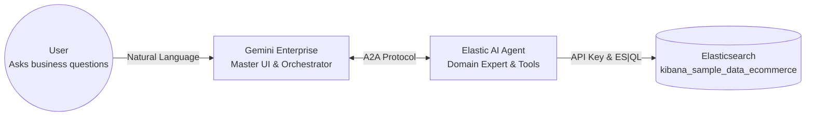

# Elastic Agent Builder + Gemini Enterprise Hands-on Lab

Welcome to the **Talk to Your Data** hands-on lab. Today, we are breaking down AI silos by integrating Elastic Agent Builder with Google's Gemini Enterprise using the open A2A (Agent-to-Agent) protocol.

## The Objective
You will build a specialized "eCommerce Data Analyst" Agent in Elastic that has direct access to your data. Instead of moving petabytes of data to an LLM, you will expose this Agent via the A2A protocol and connect it directly to the Gemini Enterprise UI.

### Architecture Overview


---

## Part 1: Elastic Environment Setup

**Facilitator:** Elastic Team

In this section, we will prepare the Elastic environment by spinning up an Elastic Cloud trial, loading our sample dataset, and ensuring our core AI integrations are configured.

### Step 1: Start an Elastic Cloud Free Trial
1. Navigate to the [Elastic Cloud Trial Page](https://www.elastic.co/cloud/cloud-trial-overview) and click **Start free trial**.
   
   

3. Sign up with your business email or Google/Microsoft account.
4. Once inside the Cloud Console, click **Create serverless project**.
5. Choose Elasticsearch in 'Which type of project would you like to create?'
   
   

7. Configure your environment details:
   - **Cloud Provider:** Select **Google Cloud (GCP)** and your preferred region.
   - **Project Name:** e.g., `elastic-ai-summit-lab`.
     
    

8. Click **Create Project** and wait a few minutes.

   

9. Click **Open project**

    

### Step 2: Load Sample eCommerce Data
1. From the Kibana home page, click for **View Sample Data** in the **Get started with Elasticsearch** page.
   
   

3. Find the **Sample eCommerce orders** dataset and click **Install data**.
   
   

5. Verify the data is loaded by checking the pre-built dashboards.
   
   

---

## Part 2: Building the Elastic Agent

**Facilitator:** Elastic Team

### Step 1: Generate an API Key
Agent and platform external (Gemini) need access to read the index and execute MCP.
Open Kibana **Dev Tools** and run:

```json
POST /_security/api_key
{
  "name": "a2a-ecommerce-api-key",
  "expiration": "30d",
  "role_descriptors": {
    "mcp-access": {
      "cluster": ["monitor_inference"],
      "indices": [
        {
          "names": ["kibana_sample_data_ecommerce", "*"],
          "privileges": ["read", "view_index_metadata"]
        }
      ],
      "applications": [
        {
          "application": "kibana-.kibana",
          "privileges": ["feature_agentBuilder.read", "feature_actions.read"],
          "resources": ["space:default"]
        }
      ]
    }
  }
}
```


> **Note:** Copy the `encoded` value from the response. This is your API Key!

### Step 2: Create a Custom ES|QL Tool
Let's build an ES|QL tool to query our eCommerce data.

<details>
<summary><b>Option A: Using Kibana UI</b></summary>

1. Navigate to **Agent Builder > Tools > Manage All Tools > + New Tool** or Type Agents / Tool in global search bar.
   

3. Click **New tool** and select **ES|QL query** as the type.
4. ID: `esql-revenue-by-region`.
5. Paste the following query:
   ```esql
   FROM kibana_sample_data_ecommerce 
   | WHERE order_date >= ?startTime 
   | STATS total_revenue = SUM(taxful_total_price), total_orders = COUNT(*) BY geoip.continent_name 
   | SORT total_revenue DESC 
   | LIMIT ?limit
   ```
6. Configure variables: `startTime` (Date) and `limit` (Integer). Save. Or the easier way you can click **Infer Parameters** and change the data type accordingly
   
7. Click **Save**

</details>

<details>
<summary><b>Option B: Using Dev Tools API</b></summary>

```json
POST kbn:/api/agent_builder/tools
{
  "id": "esql-revenue-by-region",
  "type": "esql",
  "description": "An ES|QL tool to analyze eCommerce total revenue and order counts grouped by continent, filtered by a start time.",
  "tags": ["ecommerce", "sales", "esql"],
  "configuration": {
    "query": "FROM kibana_sample_data_ecommerce | WHERE order_date >= ?startTime | STATS total_revenue = SUM(taxful_total_price), total_orders = COUNT(*) BY geoip.continent_name | SORT total_revenue DESC | LIMIT ?limit",
    "params": {
      "startTime": {
        "type": "date",
        "description": "Start time for the analysis in ISO format (e.g., 2026-01-01T00:00:00Z)"
      },
      "limit": {
        "type": "integer",
        "description": "Maximum number of results to return"
      }
    }
  }
}
```
</details>

### Step 3: Create a Custom Agent Skill
Skills define behavioral guidelines for presenting financial reports.

<details>
<summary><b>Option A: Using Kibana UI</b></summary>

1. Go to **Agent Builder > Skills > Manage All Skills**. Or you can search in global search bar
2. Click **+ New Skill**.

   

4. ID : 'ecommerce-presentation-skill' Name: `eCommerce Reporting Guidelines`.
5. Add formatting instructions (see API payload below for the text) and Save.
</details>

<details>
<summary><b>Option B: Using Dev Tools API</b></summary>

```json
POST kbn:/api/agent_builder/skills
{
  "id": "ecommerce-presentation-skill",
  "name": "eCommerce Reporting Guidelines",
  "description": "Rules for presenting eCommerce financial and operational data.",
  "content": "When answering questions about eCommerce sales:\n1. Always format 'total_revenue' in USD currency (e.g., $1,500.25).\n2. Mention the 'total_orders' to give context on volume.\n3. Present the regional breakdown in a clean bulleted list or markdown table.\n4. Provide a brief 1-2 sentence business insight summarizing the top-performing region."
}
```


</details>

### Step 4: Create the Agent & Assign Tools

<details>
<summary><b>Option A: Using Kibana UI</b></summary>

1. Go to **Agent Builder > Agents** and click **Create Agent**.
2. Name: `eCommerce Analyst`.
3. Provide system instructions defining its role.

   

5. Add Tools: Check `esql-revenue-by-region` and all `platform.core.*` utilities. Save.

   

</details>

<details>
<summary><b>Option B: Using Dev Tools API</b></summary>

```json
POST kbn:/api/agent_builder/agents
{
  "id": "elastic-ecommerce-agent",
  "name": "eCommerce Analyst",
  "description": "Hi! I am your eCommerce data analyst. Ask me about our sales revenue and regional performance.",
  "labels": ["ecommerce", "data-analyst", "esql"],
  "avatar_color": "#F04E98",
  "avatar_symbol": "EA",
  "configuration": {
    "instructions": "You are an expert eCommerce data analyst. You help users understand sales performance from the kibana_sample_data_ecommerce dataset. Use your ES|QL tools to fetch accurate data and apply your reporting skills to present it.",
    "tools": [
      {
        "tool_ids": [
          "esql-revenue-by-region",
          "platform.core.search",
          "platform.core.get_document_by_id",
          "platform.core.execute_esql",
          "platform.core.generate_esql",
          "platform.core.get_index_mapping",
          "platform.core.list_indices",
          "platform.core.generate_workflow",
          "platform.core.execute_workflow",
          "platform.core.list_workflow_executions",
          "platform.core.get_workflow_execution_status",
          "platform.core.resume_workflow_execution"
        ]
      }
    ]
  }
}
```


</details>

### Step 5: Assign the Skill via Kibana UI
1. Navigate to the **Agent Builder > Agents** tab.
2. Select and open the newly created **"eCommerce Analyst"** agent card.
3. Scroll down to the **Skills** panel.
4. Click **Add Skill**.

   

6. Pick the **"ecommerce-presentation-skill"** skill created in Step 3.
7. Save the changes.

### Step 6: Verify & Export A2A Configuration
In **Dev Tools**, run this query to fetch your fully assembled A2A Agent Card:

```json
GET kbn:/api/agent_builder/a2a/elastic-ecommerce-agent.json
```


Copy the JSON response payload and save it locally as `elastic-ecommerce-agent.json`.

### Step 7: Test the Agent in Kibana UI
Before integrating with Gemini, let's test it internally.
1. Open the **eCommerce Analyst** agent page. Click **Chat**.
2. In the chat panel, ask:
   > *"What is our total revenue and order count broken down by continent for last 7 days? Please use our custom tool and present it according to your reporting guidelines."*
3. You can see how the Agent is working and present the result
   

---

## Part 3: Gemini Enterprise Integration

**Facilitator:** Google Team

### Step 1: Google Cloud Marketplace
1. Log in to your **Google Cloud Console**.
2. Navigate to the Google Cloud Marketplace.
3. Search for **Elastic AI Agent** and click **Enable / Configure**.

### Step 2: Configure A2A Connection
1. In the configuration form, input the **Agent Card URL** / upload the `elastic-ecommerce-agent.json` file.
2. Input the **Kibana API Key** for authentication.
3. Save and Sync the configuration.

### Step 3: Verification
1. Open your **Gemini Enterprise** chat interface.
2. Check the available agents/tools list. You should now see **eCommerce Analyst** available to be invoked.

---

## Part 4: Test Your Work

### Scenario 1: Natural Language Analytics
In Gemini, ask:
> *"Ask the eCommerce Analyst Agent: What is the top-selling clothing category from last week's data?"*

### Scenario 2: Multi-Agent Handoff
Follow up with a creative task:
> *"Based on the top-selling items you just found, please draft a promotional marketing email to send to our customers."*

---

## Part 5: Actionable Workflows (HITL)

**Facilitator:** Joint

Take your Agent from a "Data Reader" to an "Action Taker" by triggering a Human-in-the-Loop (HITL) workflow directly from Gemini.

### Step 1: Create a Marketing Approval Workflow in Kibana

<details>
<summary><b>Option A: Using Kibana UI</b></summary>

1. Navigate to **Workflows Tab** and Click **Create Workflow**.
   
   

3. Paste the following definition and click **Save** and **Enable**:
```yaml
version: "1"
name: Marketing Campaign Approval
description: A HITL workflow that pauses for approval before sending a marketing email.
enabled: true
triggers:
  - type: manual
    inputs:
      properties:
        email_draft:
          type: string
          description: The generated email draft to be reviewed
        audience_email:
          type: string
          description: The email address to send the campaign to
      required:
        - email_draft
        - audience_email
steps:
  - name: ask_approval
    type: waitForInput
    with:
      message: |-
        Please review the email draft below and approve or reject:

        {{ inputs.email_draft }}

        Target audience: {{ inputs.audience_email }}
      schema:
        properties:
          approved:
            type: boolean
            description: Approve or reject the campaign
        required:
          - approved
  - name: check_approval
    type: if
    condition: "steps.ask_approval.output.response.approved : true"
    steps:
      - name: send_campaign_email
        type: email
        connector-id: Elastic-Cloud-SMTP
        with:
          to:
            - "{{ inputs.audience_email }}"
          subject: Marketing Campaign
          message: "{{ inputs.email_draft }}"
    else:
      - name: log_rejection
        type: console
        with:
          message: "Campaign rejected. Email was NOT sent to {{ inputs.audience_email }}"
```


</details>

<details>
<summary><b>Option B: Using Dev Tools API</b></summary>

```json
POST kbn:/api/workflows
{
  "name": "Marketing Campaign Approval",
  "description": "A HITL workflow that pauses for approval before sending a marketing email.",
  "enabled": true,
  "workflow": "version: \"1\"\nname: Marketing Campaign Approval\ndescription: A HITL workflow that pauses for approval before sending a marketing email.\nenabled: true\ntriggers:\n  - type: manual\n    inputs:\n      properties:\n        email_draft:\n          type: string\n          description: The generated email draft to be reviewed\n        audience_email:\n          type: string\n          description: The email address to send the campaign to\n      required:\n        - email_draft\n        - audience_email\nsteps:\n  - name: ask_approval\n    type: waitForInput\n    with:\n      message: |-\n        Please review the email draft below and approve or reject:\n\n        {{ inputs.email_draft }}\n\n        Target audience: {{ inputs.audience_email }}\n      schema:\n        properties:\n          approved:\n            type: boolean\n            description: Approve or reject the campaign\n        required:\n          - approved\n  - name: check_approval\n    type: if\n    condition: \"steps.ask_approval.output.response.approved : true\"\n    steps:\n      - name: send_campaign_email\n        type: email\n        connector-id: elastic-cloud-email\n        with:\n          to:\n            - \"{{ inputs.audience_email }}\"\n          subject: Exclusive Marketing Offer\n          message: \"{{ inputs.email_draft }}\"\n    else:\n      - name: log_rejection\n        type: console\n        with:\n          message: \"REJECTED! Email draft was not approved for {{ inputs.audience_email }}\""
}
```
</details>

### Step 2: Expose Workflow as a Tool
1. Navigate to **Agents / Tools** and click **Create Tool**.
2. Select **Workflow** as the tool type and choose **Marketing Campaign Approval** workflow
3. Tool ID `marketing-campaign`, description 'workflows to create and send marketing-campaign', and click **Save**.
4. Go to **Agent Builder > Agents** and open your **eCommerce Analyst** agent.
5. In the **Tools** section, click **Add Tool** and select **marketing-campaign**. *(Ensure `platform.core.get_workflow_execution_status` and `platform.core.resume_workflow_execution` are also attached).*

   

7. Click **Save**.

### Step 3: Test the Workflow in Kibana Agent Builder
1. In the **Test your agent** chat panel, type:
   > *"Draft a promotional email for men's shoes and execute the Marketing Campaign Approval workflow to send it to my_email@example.com."*
2. The agent will call `execute_workflow` and pause for approval.
3. Reply: *"approve"*
   
5. The agent will resume the workflow and send the email!
   


### Step 4: Trigger the Action from Gemini
Now, run the exact same process from our external Gemini Enterprise interface:
> *"Based on the men's shoe sales data rising, please create a promotional email draft. Then, execute the marketing workflow to send it to my_email@example.com, but wait for my approval first."*

---
*Powered by Elastic & Google Cloud*
